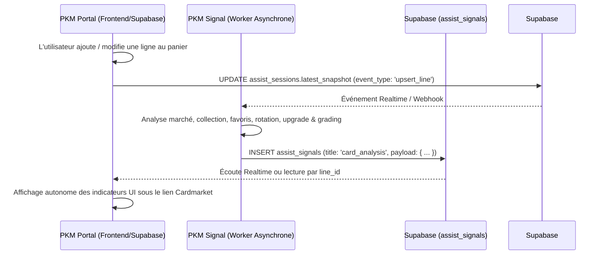

# Notice d'Intégration PKM Portal — Contrat Méta "Buy Analysis" (`card_analysis`)

## 1. Contexte & Règle d'Architecture Headless

PKM Signal est un moteur de calcul analytique et d'intelligence de marché pur (**Headless**).
- **Règle absolue :** Signal ne produit **JAMAIS** de HTML, de styles CSS ou de composants visuels. Il calcule et expose exclusivement des données brutes, prévisibles et standardisées au format JSON.
- **Rôle de PKM Portal :** PKM Portal est le consommateur souverain. Il décide en toute autonomie :
  - des critères et seuils de filtrage UI ;
  - du format visuel (badges, pastilles, bannières, infobulles) ;
  - de l'emplacement d'affichage (prioritairement sous le lien Cardmarket de chaque ligne du panier d'achat).

---

## 2. Cycle de Vie Événementiel (Event-Driven)



### Format de l'événement émis par Portal (`upsert_line`)

Lorsque l'utilisateur ajoute ou modifie une carte dans un panier d'achat, Portal écrit dans la session active (`assist_sessions.latest_snapshot`) :

```json
{
  "event_type": "upsert_line",
  "draft_order_id": "draft-ord-2026-001",
  "item": {
    "line_id": "line-item-12345",
    "card_id": "swsh7-215",
    "condition": "NM",
    "buy_price_unit": 35.0,
    "set_id": "swsh7",
    "variant": "N",
    "language": "FR"
  }
}
```

> [!NOTE]
> **Tolérance Prix = 0 € :** Même si la carte vient d'être ajoutée au panier avec `buy_price_unit = 0` (avant saisie manuelle du prix), Signal s'exécute sans aucune erreur de division par zéro.

---

## 3. Structure de Restitution dans `assist_signals`

Signal enregistre l'analyse unitaire dans la table Supabase `assist_signals` avec les attributs suivants :

| Colonne | Valeur | Description |
|---|---|---|
| `scope` | `'item'` | Portée unitaire par ligne de carte |
| `entity_ref` | `line.line_id` | Identifiant de la ligne panier (`item.line_id`) |
| `card_id` | `line.card_id` | Identifiant métier de la carte (ex: `"swsh7-215"`) |
| `title` | `'card_analysis'` | Type de signal méta |
| `severity` | `'info'` | Gravité standard |
| `status` | `'active'` | Passe à `'resolved'` si la ligne est supprimée (`remove_line`) |
| **`payload`** | `JSON Object` | **Le contrat méta standardisé décrit ci-dessous** |

---

## 4. Spécification Complète du Payload (`assist_signals.payload`)

### Schéma JSON Type

```json
{
  "card_id": "swsh7-215",
  "quote": {
    "value": 45.0,
    "date": "2026-09-08",
    "is_fresh": true,
    "is_reliable": true,
    "needs_recot": false,
    "recoted": true,
    "recot_skip_reason": null,
    "quota_display": "5/10",
    "quota_used": 5,
    "quota_max": 10,
    "quota_remaining": 5
  },
  "quotas": {
    "live_assist": {
      "used": 5,
      "max": 10,
      "remaining": 5,
      "display": "5/10"
    },
    "global_daily": {
      "used": 5,
      "max": 50,
      "remaining": 45,
      "display": "5/50"
    }
  },
  "platforms": {
    "cardmarket": {
      "id_product": 574273,
      "price": 897.29,
      "trend": 897.29,
      "low": 115.9,
      "avg": 1594.4,
      "avg7": 1717.09,
      "avg30": 2046.61,
      "updated_at": "2026-09-12T06:32:46.300Z",
      "url": "https://www.cardmarket.com/fr/Pokemon/Products?idProduct=574273&language=2",
      "unit": "EUR",
      "quota_display": "5/10",
      "quota_used": 5,
      "quota_max": 10,
      "quota_remaining": 5
    },
    "tcgplayer": {
      "source": "tcgplayer",
      "product_id": 246723,
      "market_price_usd": 2368.34,
      "market_price_eur": 2178.87,
      "low_price_usd": 1804.01,
      "mid_price_usd": 2310,
      "url": "https://www.tcgplayer.com/product/246723",
      "updated_at": "2026-09-12T06:33:30.976Z",
      "unit": "USD"
    }
  },
  "search_intent": {
    "is_wanted": true,
    "targets": [
      { "owner": "mathieu", "reason": "favorite" },
      { "owner": "leo", "reason": "set_completion", "set_id": "swsh7", "progress_pct": 24.5 }
    ]
  },
  "collection": {
    "owned": true,
    "owners": ["mathieu"],
    "missing_for": ["ewan", "leo"]
  },
  "upgrade": {
    "is_upgrade": true,
    "targets": [
      { "owner": "mathieu", "current_condition": "EX", "incoming_condition": "NM" }
    ]
  },
  "sales_velocity": {
    "sold_count_12m": 3,
    "is_hard_to_sell": false,
    "last_sold_date": "2026-08-15"
  },
  "investment": {
    "is_invest_candidate": true,
    "grading_potential": true
  },
  "stock_pressure": {
    "current_stock_total": 1,
    "overstock_risk": false
  }
}
```

---

## 5. Dictionnaire des Indicateurs & Guide d'Affichage UI pour Portal

Chaque bloc est conçu pour alimenter directement un composant ou un tag UI dans Portal sans calcul supplémentaire.

### 5.1 Cotation, Recotation & Garde-fous (`payload.quote`)

| Champ | Type | Description | Règle Métier Signal |
|---|---|---|---|
| `value` | `number \| null` | Cote en euros | Relevé actuel ou frais mis à jour |
| `date` | `string \| null` | Date ISO (YYYY-MM-DD) | Date de relevé de la cote |
| `is_fresh` | `boolean` | Cote récente | `true` si date `<= 7 jours` par rapport à aujourd'hui |
| `is_reliable` | `boolean` | Cote vérifiée | `true` si source vérifiée (CardMarket, transactions réelles) et `value > 0` |
| `needs_recot` | `boolean` | Besoin de mise à jour | `true` si date `> 7 jours` ou cote absente |
| `recoted` | `boolean` | Recotée en direct au panier | `true` si un appel CardMarket a été exécuté et persisté en base |
| `recot_skip_reason` | `string \| null` | Motif d'exemption de recot | `'buy_price_must_exceed_10'`, `'not_french_language'`, `'condition_not_nm'`, `'card_is_graded'`, `'variant_not_eligible'`, `'recent_quote_fresh'`, `'live_assist_daily_limit_reached'` |
| `quota_display` | `string \| null` | Compteur du jour | Ex: `"3/10"` (3 requêtes utilisées sur 10 autorisées aujourd'hui) |
| `quota_used` | `number \| null` | Requêtes consommées | Nombre d'appels réalisés aujourd'hui (ex: `3`) |
| `quota_max` | `number \| null` | Plafond journalier | Limite autorisée pour Acheter (défaut: `10`, global: `50`) |
| `quota_remaining` | `number \| null` | Requêtes restantes | Nombre d'appels restants pour aujourd'hui (ex: `7`) |

#### 🛡️ Les Critères Stricts de Recotation Automatique en Direct (Phase 1) :
Pour éviter tout gaspillage et tester de manière 100% contrôlée, la recotation CardMarket n'est déclenchée que si **tous** les critères suivants sont réunis :
1. **Prix d'achat :** Strictement supérieur à **10 €** (`buy_price_unit > 10.0`). L'utilisateur renseigne les attributs avant le prix, ce qui arme la requête lors de la saisie financière.
2. **Langue :** Strictly **FR** (`language === 'FR'`).
3. **État :** Strictly **NM** (`condition === 'NM'`).
4. **Non gradé :** Aucune carte sous boîtier de gradation (`GRA`, `PSA`, `PCA`, etc.).
5. **Variante :** Strictly **Variant N (Normale / Standard)** pour ce premier test (puis R sera ajouté ultérieurement, ou configurable via `LIVE_RECOT_ALLOWED_VARIANTS`).
6. **Quota Dédié Acheter :** Max **10 requêtes / jour** (dans la limite globale de 50 requêtes / jour).
7. **Péremption :** Dernière cote en base **> 7 jours** (ou inexistante). Si une cote a 7 jours ou moins, elle est réutilisée sans appel réseau.

> [!IMPORTANT]
> **Persistance et Quotas :** Dès qu'une cote est obtenue, elle est immédiatement sauvegardée dans la base Supabase (`current_cotes` / `price_history`). Même si l'utilisateur supprime la ligne du panier ou la modifie par la suite, la cote reste acquise pour tout le système et la requête reste décomptée du quota journalier.

### 5.2 Données Multi-Plateformes (`payload.platforms`)

#### CardMarket (`payload.platforms.cardmarket`)
- `trend` : Prix tendance officiel (ex: `45.00 €`, ou `trend-holo` si variante R)
- `low` : Prix le plus bas actuel (ex: `19.50 €`)
- `avg30` : Prix moyen sur 30 jours (ex: `41.23 €`)
- `url` : URL officielle vers la fiche produit CardMarket (avec `&isReverseHolo=Y` si variante R)
- `quota_display` : Compteur de quota (ex: `"3/10"`)
- `updated_at` : Date du relevé CardMarket

**Recommandation d'affichage Portal :**
- Message standard retourné dans le signal : `"Cote CM : 33,56€ (3/10)"`.
- Si `quote.recoted === true` : Afficher un badge d'actualisation directe (ex: `⚡ Recoté CM : 33,56€ (3/10)`) et mettre à jour le prix de référence de la ligne.
- Infobulle CardMarket au survol du logo : `Tendance : 33.56 € | Min : 19.50 € | 30j : 41.23 € (Quota: 3/10)`.
- Si `recot_skip_reason === 'live_assist_daily_limit_reached'` : Alerte discrète `Quota journalier atteint (10/10)`.

---

### 5.2 Intention de Recherche (`payload.search_intent`)

| Champ | Type | Description |
|---|---|---|
| `is_wanted` | `boolean` | `true` si la carte est en favori OU activement recherchée pour complétion |
| `targets` | `Array<Object>` | Liste des personnes concernées et des motifs |

**Structure des cibles (`targets`) :**
- Pour un favori : `{ "owner": "mathieu", "reason": "favorite" }`
- Pour une complétion de set : `{ "owner": "leo", "reason": "set_completion", "set_id": "swsh7", "progress_pct": 24.5 }`

**Recommandation d'affichage Portal :**
- Badge violet ou coeur : `❤️ Favori Mathieu`
- Badge bleu : `🎯 Complétion Léo (24.5% de swsh7)`

---

### 5.3 Statut en Collection (`payload.collection`)

| Champ | Type | Description |
|---|---|---|
| `owned` | `boolean` | `true` si au moins un propriétaire la possède en collection |
| `owners` | `string[]` | Liste des propriétaires la possédant (ex: `["mathieu"]`) |
| `missing_for` | `string[]` | Liste des profils actifs ne la possédant pas (ex: `["ewan", "leo"]`) |

**Recommandation d'affichage Portal :**
- Si `owned = true` : Badge `En collection : Mathieu`
- Si `missing_for.length > 0` : Badge `Manque à : Ewan, Léo`

---

### 5.4 Opportunité d'Upgrade d'État (`payload.upgrade`)

| Champ | Type | Description |
|---|---|---|
| `is_upgrade` | `boolean` | `true` si l'état entrant est strictement supérieur au meilleur état déjà possédé |
| `targets` | `Array<Object>` | Détail des cibles d'upgrade |

**Structure des cibles (`targets`) :**
- `{ "owner": "mathieu", "current_condition": "EX", "incoming_condition": "NM" }`

**Recommandation d'affichage Portal :**
- Badge doré : `✨ Upgrade Mathieu (EX ➔ NM)`

---

### 5.5 Vélocité de Vente & Rotation (`payload.sales_velocity`)

| Champ | Type | Description |
|---|---|---|
| `sold_count_12m` | `number` | Nombre total d'exemplaires vendus sur les 12 derniers mois |
| `is_hard_to_sell` | `boolean` | Drapeau rotation lente |
| `last_sold_date` | `string \| null` | Date de la dernière vente (YYYY-MM-DD) |

> [!WARNING]
> `is_hard_to_sell` est levé à `true` si la carte est en stock commercial depuis plus de 60 jours sans aucune vente récente.

**Recommandation d'affichage Portal :**
- Si `is_hard_to_sell = true` : Badge d'avertissement `⏳ Rotation lente (>60j sans vente)`
- Si `sold_count_12m > 0` : Information `Vendus 12m : 3 ex. (dernière: 2026-08-15)`

---

### 5.6 Indicateurs de Qualité & Investissement (`payload.investment`)

| Champ | Type | Description |
|---|---|---|
| `grading_potential` | `boolean` | `true` si état `NM`/`Mint`, haute rareté (SAR, AR, Secret, Ultra) et cote `> 30 €` |
| `is_invest_candidate` | `boolean` | `true` si candidate à l'investissement (grading ou forte valeur) |

**Recommandation d'affichage Portal :**
- Si `grading_potential = true` : Pastille `💎 Potentiel Grading (SAR - NM - 45€)`

---

### 5.7 Pression de Stock (`payload.stock_pressure`)

| Champ | Type | Description |
|---|---|---|
| `current_stock_total` | `number` | Stock commercial total actuellement détenu |
| `overstock_risk` | `boolean` | `true` si stock commercial `>= 3 ex.` sans vente récente |

**Recommandation d'affichage Portal :**
- Si `overstock_risk = true` : Alerte `⚠️ Surstock commercial (3 ex. déjà en stock)`

---

## 6. Exemple d'Intégration Frontend (React / Vue / Svelte)

Dans le composant de ligne de commande d'achat :

```typescript
// Récupération du signal pour la ligne courante
const analysis = signals.find(s => s.entity_ref === item.line_id && s.title === 'card_analysis')?.payload;

if (!analysis) return null;

return (
  <div className="card-analysis-row flex flex-wrap gap-2 text-xs mt-1">
    {/* Cote & Fraîcheur */}
    <span className={`px-2 py-0.5 rounded ${analysis.quote.is_fresh ? 'bg-green-100 text-green-800' : 'bg-amber-100 text-amber-800'}`}>
      Cote: {analysis.quote.value ? `${analysis.quote.value}€` : 'N/A'} {analysis.quote.is_fresh ? '✓' : '(>7j)'}
    </span>

    {/* Upgrade */}
    {analysis.upgrade.is_upgrade && (
      <span className="px-2 py-0.5 rounded bg-amber-100 text-amber-900 font-semibold">
        ✨ Upgrade {analysis.upgrade.targets.map(t => `${t.owner} (${t.current_condition}➔${t.incoming_condition})`).join(', ')}
      </span>
    )}

    {/* Intention de recherche */}
    {analysis.search_intent.targets.map((t, idx) => (
      <span key={idx} className="px-2 py-0.5 rounded bg-purple-100 text-purple-800">
        {t.reason === 'favorite' ? `❤️ Favori ${t.owner}` : `🎯 Complétion ${t.owner} (${t.progress_pct}%)`}
      </span>
    ))}

    {/* Potentiel Grading */}
    {analysis.investment.grading_potential && (
      <span className="px-2 py-0.5 rounded bg-blue-100 text-blue-800 font-medium">
        💎 Potentiel Grading
      </span>
    )}

    {/* Risques : Surstock ou Rotation Lente */}
    {analysis.stock_pressure.overstock_risk && (
      <span className="px-2 py-0.5 rounded bg-red-100 text-red-800 font-semibold">
        ⚠️ Surstock ({analysis.stock_pressure.current_stock_total} ex.)
      </span>
    )}
    {analysis.sales_velocity.is_hard_to_sell && (
      <span className="px-2 py-0.5 rounded bg-orange-100 text-orange-800">
        ⏳ Rotation lente
      </span>
    )}
  </div>
);
```
